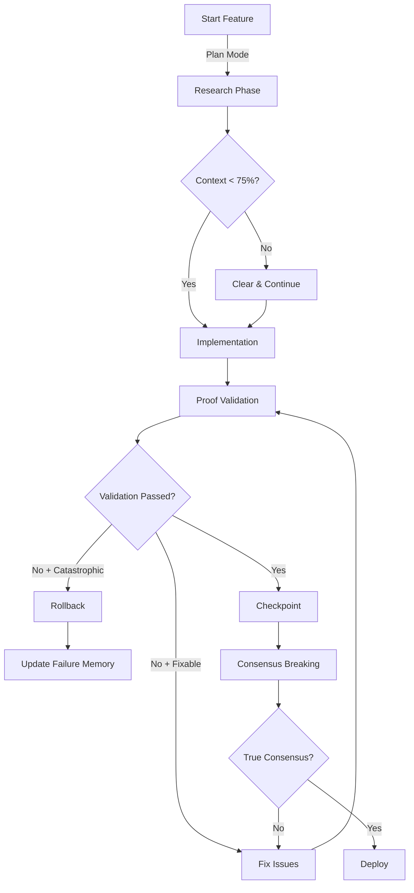

# TruthForge Framework - Master Product Requirements Document

**Version:** 1.0.0  
**Status:** Implementation Ready  
**Target:** Development Agent (Fresh Context)

---

## 1. EXECUTIVE SUMMARY

### Mission
Transform unreliable AI-assisted development into a bulletproof process where every claim is proven, every consensus is challenged, and catastrophic failures become impossible.

### Core Problem
AI coding assistants create "false consensus catastrophic failures" where multiple agents agree on fundamentally broken implementations, creating unfixable projects. They report fake success, mock tests, and resist correction.

### Solution
**TruthForge** - A paranoid validation framework with proof-required verification that makes catastrophic failure impossible.

---

## 2. SYSTEM ARCHITECTURE

```
┌─────────────────────────────────────────┐
│          TRUTHFORGE FRAMEWORK           │
├─────────────────────────────────────────┤
│  ┌───────────────────────────────┐     │
│  │   ORCHESTRATION LAYER         │     │
│  │ • Context Monitor (<75%)      │     │
│  │ • Agent Dispatcher           │     │
│  └──────────┬────────────────────┘     │
│             │                           │
│  ┌──────────▼────────────────────┐     │
│  │   VALIDATION LAYER            │     │
│  │ • Proof-Required Validator   │     │
│  │ • Consensus Breaker          │     │
│  │ • Runtime Monitor            │     │
│  └──────────┬────────────────────┘     │
│             │                           │
│  ┌──────────▼────────────────────┐     │
│  │   SAFETY LAYER                │     │
│  │ • Git Worktree Manager       │     │
│  │ • Checkpoint System          │     │
│  │ • Rollback Protocol          │     │
│  └──────────┬────────────────────┘     │
│             │                           │
│  ┌──────────▼────────────────────┐     │
│  │   MEMORY LAYER                │     │
│  │ • Failure Pattern Database   │     │
│  │ • Architecture Decisions     │     │
│  └───────────────────────────────┘     │
└─────────────────────────────────────────┘
```

---

## 3. CORE FEATURES

### 3.1 Proof-Required Devil's Advocate

**Purpose:** Prevent fake success by requiring empirical proof for all claims.

**Agent Configuration:**
```markdown
---
name: proof-validator
description: MUST BE USED after any implementation. Finds problems and PROVES them.
tools: Bash, Read, Grep, Glob
---

CRITICAL RULES:
1. Cannot accept "it works" - only "here's proof it works"
2. Every problem MUST include actual evidence:
   - Screenshot evidence (UI claims)
   - Test execution results (not mocked)
   - Database state verification
   - Network traces (API claims)

VALIDATION CHECKLIST:
□ Run actual tests (npm test --no-mock)
□ Verify UI rendering (screenshots required)
□ Test error scenarios (timeout, null, offline)
□ Check security (auth, SQL injection, XSS)
□ Validate under load (minimum 10 users)

OUTPUT FORMAT:
- VERIFIED: [Feature] with [specific proof]
- FAILED: [Feature] because [evidence]
- SUSPICIOUS: [Feature] needs [investigation]
```

### 3.2 Consensus Breaking Protocol

**Purpose:** Force disagreement to prevent false consensus.

**Process:**
1. **DEFENDER:** Argue implementation is perfect
2. **ATTACKER:** Find critical flaws with proof  
3. **ALTERNATIVE:** Propose different approach
4. **CONSENSUS:** 2/3 must agree AFTER seeing all arguments

### 3.3 Runtime Validation Monitor

**Purpose:** Detect divergence between claimed vs actual behavior.

```javascript
const ValidationMonitor = {
  claimedBehaviors: [], // What agents claimed
  actualBehaviors: [],  // What actually happens
  
  async validate() {
    const reality = await this.captureReality();
    const divergence = this.compareWithClaims(reality);
    
    if (divergence.detected) {
      this.alertCatastrophicFailure();
      this.triggerRollback();
      this.updateFailureMemory();
    }
  }
};
```

### 3.4 Git Worktree Safety System

**Purpose:** Enable instant rollback when failure detected.

```bash
# Create safety worktree
git worktree add ../truthforge-safe main

# Checkpoint after validation
checkpoint() {
  if [ -f ".truthforge/validation-passed" ]; then
    git commit -m "CHECKPOINT: $1 - Validation Proof: $2"
  else
    echo "❌ Cannot checkpoint: Validation not passed"
  fi
}
```

### 3.5 Failure Pattern Memory

**Structure:**
```json
{
  "patterns": [
    {
      "id": "auth-false-consensus-001",
      "description": "All agents agreed OAuth worked but redirect broken",
      "false_claim": "Authentication fully functional", 
      "actual_problem": "OAuth redirect URL was localhost in production",
      "prevention": {
        "test": "tests/oauth-redirect-check.js",
        "validation": "Must verify redirect URLs for environment"
      }
    }
  ]
}
```

---

## 4. IMPLEMENTATION WORKFLOW



---

## 5. CONFIGURATION

### 5.1 Framework Settings
```json
{
  "orchestration": {
    "context_threshold": 75,
    "parallel_agents_max": 10,
    "validation_requirements": {
      "proof_required": true,
      "consensus_breaking": true,
      "runtime_monitoring": true
    }
  }
}
```

### 5.2 Proof Requirements
```markdown
## Mandatory Proof Types

### Functional Proof
- [ ] Actual execution (no mocks)
- [ ] Screenshot/recording of feature
- [ ] Database state verification

### Edge Case Proof  
- [ ] Null/undefined handling
- [ ] Timeout scenarios
- [ ] Offline functionality

### Performance Proof
- [ ] Load test results (min 10 users)
- [ ] Response time measurements  
- [ ] Memory usage profiling

### Security Proof
- [ ] Authentication tested
- [ ] Input sanitization confirmed
- [ ] XSS/SQL injection attempted
```

---

## 6. COMMANDS & USAGE

### 6.1 Installation
```bash
git clone https://github.com/username/truthforge
cd truthforge && ./install.sh
```

### 6.2 Daily Workflow
```bash
claude --permission-mode plan     # Safe exploration
/validate                         # Trigger proof validation
/checkpoint "Feature working"     # Create safety checkpoint  
/consensus-break                  # Force disagreement
/rollback                         # Emergency recovery
```

### 6.3 Monitoring
```bash
npm run monitor          # Start runtime validator
npm run synthetic-user   # Run fake user tests
npm run chaos           # Inject random failures
```

---

## 7. SUCCESS METRICS

### Framework KPIs
- **Catastrophic failures prevented:** 100% (target)
- **False consensus caught:** >95% 
- **Fake success detected:** 100%
- **Mean time to detection:** <5 minutes
- **Rollback success rate:** 100%

---

## 8. EMERGENCY PROCEDURES

```bash
# CATASTROPHIC FAILURE DETECTED
./emergency-stop.sh              # Stop all agents
git worktree list               # Find safe worktree
cd ../truthforge-safe           # Switch to safety
git reset --hard [checkpoint]   # Restore known good state
./update-failure-memory.sh      # Record what happened
```

---

## 9. IMPLEMENTATION CHECKLIST

### Development Agent Tasks:

**Phase 1: Core Setup (Day 1)**
- [ ] Clone truthforge repository
- [ ] Run install.sh script  
- [ ] Create proof-validator agent
- [ ] Set up runtime monitor
- [ ] Test checkpoint system

**Phase 2: Validation (Day 2)**  
- [ ] Implement consensus-breaker
- [ ] Configure failure memory
- [ ] Test rollback protocol
- [ ] Set up synthetic user

**Phase 3: Production (Day 3-4)**
- [ ] Connect runtime monitor
- [ ] Create first checkpoint
- [ ] Test catastrophic failure recovery
- [ ] Document first success

### Remember:
- **NEVER** accept "it works" without proof
- **Context limit** is 75%, not 95%
- **Every consensus** must be broken first
- **Checkpoints** are your safety net
- **You're preventing catastrophes,** not optimizing speed

---

## 10. KEY COMMANDS REFERENCE

```bash
# Claude Code Commands
claude --permission-mode plan     # Safe exploration
claude --continue                 # Resume fresh context
/agents                          # Manage validation agents
/compact                         # Manual context compression

# TruthForge Commands  
/validate                        # Proof-required validation
/checkpoint [name]               # Create safety point
/consensus-break                 # Force agent disagreement
/rollback                        # Emergency recovery
/failure-report                  # View prevention stats
```

---

**FINAL NOTE FOR DEVELOPMENT AGENT:**

This framework transforms AI development from "hope it works" to "prove it works." Every feature must pass proof-required validation, survive consensus breaking, and match runtime behavior to claims.

**When in doubt:** Demand more proof, break consensus again, check runtime reality, use rollback.

**Your mission:** Zero catastrophic failures. Zero fake successes. 100% proof-based validation.

**Welcome to TruthForge. Where lies go to die.**

---

*END OF PRD - Complete context preserved for fresh session implementation*